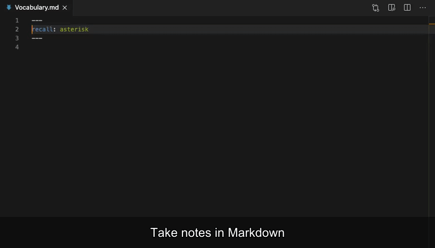

# Home

### What is Recall? 

**Recall** is an extension of Microsoft’s Visual Studio Code to help you remember stuff using [spaced repetition](https://en.wikipedia.org/wiki/Spaced\_repetition).

It creates flashcards directly from your Markdown notes and let’s you test yourself repeatedly to maximize your memory retention. This can be usefull when learning a new language, taking a course on a particular subject, remembering jokes or pretty much anything else you want to remember. The choice is yours 😉

### Why use it? 

Spaced repetition using flashcards is one of the most effective methods to memorize things. However, creating them usually takes too much time and extra effort. **Recall** makes it super-easy by auto-detecting flashcards directly in your Markdown notes.

<figure><figcaption></figcaption></figure>
