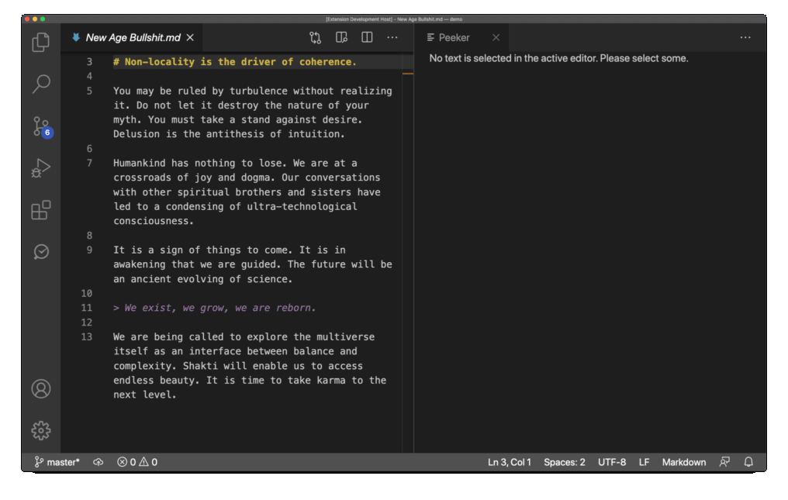

# Peeker

This is a nifty little extension I have created to make my life easier when studying a foreign language. Peeker is a lightweight tool with a single purpose - quickly lookup currently selected text on a predefined website.

The demo below uses the Urban Dictionary. For my spanish notes, I use the following config which let’s me instantly look up the definition of any word or phrase in my notes.

```json
{
  "peeker.template": "https://www.spanishdict.com/translate/%s"
}
```

<figure><figcaption></figcaption></figure>

For more information, go ahead and check out the extension [README](https://marketplace.visualstudio.com/items?itemName=frenya.vscode-peeker).
